# 🛍️ Retail Sales & Inventory Analytics Dashboard

> An end-to-end Retail Sales & Inventory Analytics project built using **SQL, Python, and Power BI** to analyze retail business performance, customer behavior, inventory optimization, and sales forecasting.

---

## 📌 Project Overview

This project demonstrates the complete data analytics workflow, starting from data generation and cleaning to exploratory data analysis, customer segmentation, inventory analysis, sales forecasting, and interactive dashboard creation.

The dashboard enables stakeholders to monitor business performance through executive KPIs, customer insights, inventory optimization metrics, and future sales forecasts.

---

## 🎯 Objectives

- Analyze retail sales performance.
- Understand customer purchasing behavior.
- Segment customers using RFM Analysis.
- Perform ABC Inventory Analysis.
- Forecast future sales using Machine Learning.
- Build an interactive Power BI dashboard for business decision-making.

---

# 🛠 Tech Stack

| Technology | Purpose |
|------------|----------|
| SQL | Database Design & Analysis |
| MySQL | Data Storage |
| Python | Data Cleaning & Analysis |
| Pandas | Data Manipulation |
| NumPy | Numerical Computing |
| Matplotlib | Data Visualization |
| Scikit-learn | Sales Forecasting |
| Jupyter Notebook | Development Environment |
| Power BI | Interactive Dashboard |
| DAX | KPI Measures |
| Excel / CSV | Dataset Storage |

---

# 📂 Project Structure

```text
Retail-Sales-Inventory-Analytics/
│
├── data/
│   ├── clean_sales_data.csv
│   ├── customers.csv
│   ├── inventory.csv
│   ├── products.csv
│   └── sales.csv
│
├── images/
│   ├── abc_analysis/...
│   ├── business_analysis/...
│   ├── dashboard_screenshots/...
│   ├── database/...
│   ├── forecasting/...
│   ├── python_eda/...
│   ├── rfm_analysis/...
│   ├── sql_advanced/...
│   └── sql_analysis/...
│
├── powerbi/
│   ├── Retail_Sales_Analytics.pbix
│   └── theme.json
│
├── python/
│   ├── abc_inventory_analysis.ipynb
│   ├── eda.ipynb
│   ├── generate_dataset.py
│   ├── rfm_analysis.ipynb
│   └── sales_forecasting.ipynb
│
├── reports/
│   ├── abc_inventory_analysis.csv
│   ├── business_summary.csv
│   ├── customer_rfm_analysis.csv
│   ├── database_schema.md
│   └── sales_forecast.csv
│
├── sql/
│   ├── queries.sql
│   └── schema.sql
│
├── README.md
├── requirements.txt
└── .gitignore
```

---

# ⚙️ Project Workflow

```
Dataset Generation
        │
        ▼
MySQL Database
        │
        ▼
SQL Analysis
        │
        ▼
Python Data Cleaning
        │
        ▼
EDA & Feature Engineering
        │
        ▼
RFM Customer Segmentation
        │
        ▼
ABC Inventory Analysis
        │
        ▼
Sales Forecasting
        │
        ▼
Power BI Dashboard
        │
        ▼
Business Insights
```

---

# 🗄️ Database Schema (ER Diagram)

The project is built on a relational database consisting of four primary tables:

- 📦 Products
- 👥 Customers
- 🛒 Sales
- 🏬 Inventory

The Sales table acts as the fact table and connects customer and product information, while Inventory stores warehouse stock details for each product.

### ER Diagram

<p align="center">
  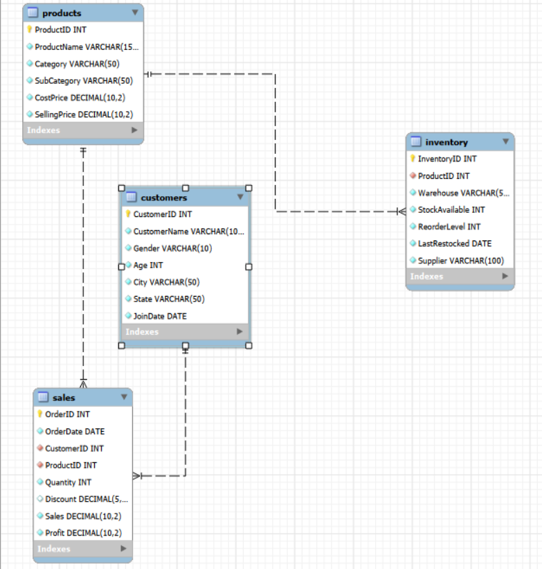
</p>

---

# 📊 Dashboard Overview

The Power BI dashboard consists of **four interactive pages**.

---

## 📈 1. Executive Overview

Provides a high-level summary of business performance.

### KPIs

- 💰 Total Sales
- 🛒 Total Orders
- 👥 Total Customers
- 📦 Total Products

### Visualizations

- Monthly Revenue Trend
- Revenue by Category
- Top 10 Cities by Revenue
- Top 10 Products

---

## 👥 2. Customer Analytics

Analyzes customer purchasing behavior using RFM Segmentation.

### KPIs

- 👥 Total Customers
- 💰 Average Customer Spend
- 🛍 Average Order Value
- 📈 Customer Revenue

### Visualizations

- Customer Segment Distribution
- Revenue by Customer Segment
- Top 10 Customers
- Customer Segment Summary

---

## 📦 3. Inventory Analytics

Provides inventory optimization insights using ABC Analysis.

### KPIs

- 📦 Total Inventory Value
- 🛍 Total Products
- ⚠️ Low Stock Products
- 💚 Healthy Inventory
- 🏢 Warehouses

### Visualizations

- ABC Category Distribution
- Inventory Value by ABC Category
- Current Stock by Category
- Top Inventory Products

---

## 📈 4. Sales Forecast & Trends

Forecasts future sales using Linear Regression.

### KPIs

- 💰 Total Sales
- 📈 Total Profit
- 🛒 Average Order Value
- 📊 Forecast Growth
- 🔮 Average Forecast Sales

### Visualizations

- Monthly Revenue Trend
- Six-Month Sales Forecast
- Forecast Table
- Model Evaluation
- Forecast Summary

---

# 📊 Key Business Insights

### 💰 Sales Insights

- Generated over **₹1.09 Billion** in total revenue.
- Revenue remained relatively stable throughout the analysis period.
- Electronics generated the highest revenue among all product categories.
- Top-selling products contributed significantly to overall sales.

---

### 👥 Customer Insights

- Nearly half of customers belong to the **Regular Customers** segment.
- Champions and Loyal Customers generated the highest average spending.
- A relatively small percentage of customers contributed disproportionately to revenue.
- Customer segmentation provides opportunities for targeted marketing campaigns.

---

### 📦 Inventory Insights

- Category A products account for the majority of inventory value.
- Inventory value is highly concentrated among a small number of products.
- Multiple products fall below the reorder level, highlighting restocking priorities.
- Current stock levels vary across product categories.

---

### 📈 Forecast Insights

- Monthly sales remain relatively stable with moderate fluctuations.
- Linear Regression achieved an **R² Score of 0.008**, indicating a weak linear relationship.
- The six-month forecast suggests a slight upward trend in expected sales.
- More advanced time-series models (ARIMA or Prophet) could improve forecast accuracy.

---

# 🤖 Machine Learning

### Model

- Linear Regression

### Evaluation

- R² Score: **0.008**

### Future Improvements

- Prophet Forecasting
- ARIMA
- XGBoost Regression
- LSTM Time-Series Forecasting

---

# 📁 Reports

The project includes automatically generated reports:

- Business Summary
- Customer RFM Analysis
- ABC Inventory Analysis
- Sales Forecast
- Database Schema Documentation

---

# 🚀 Skills Demonstrated

- SQL Query Writing
- Database Design
- Data Cleaning
- Exploratory Data Analysis
- Customer Segmentation
- Inventory Optimization
- Machine Learning
- Sales Forecasting
- Data Visualization
- Dashboard Design
- Power BI
- DAX
- Business Analytics

---

# 📸 Dashboard Screenshots

## 🏠 Executive Overview

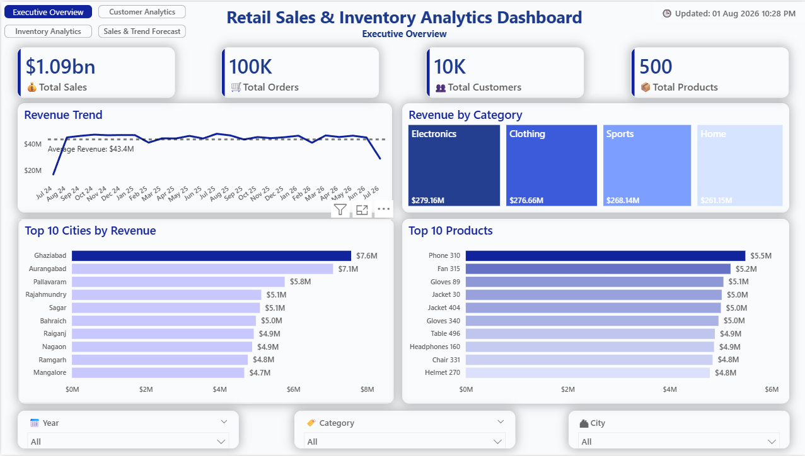

---

## 👥 Customer Analytics

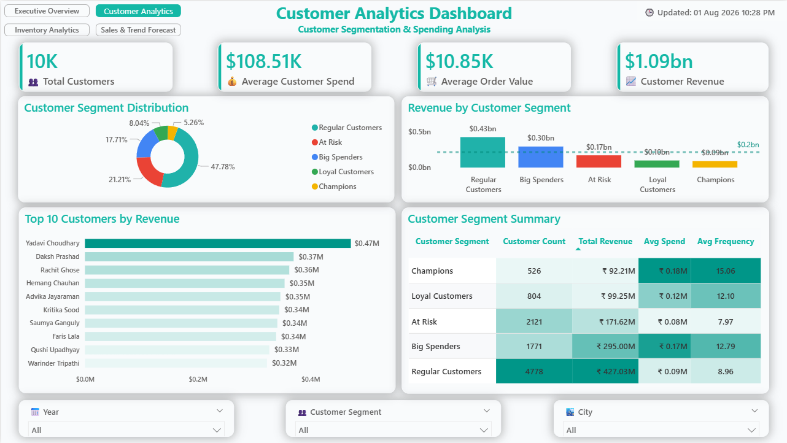

---

## 📦 Inventory Analytics

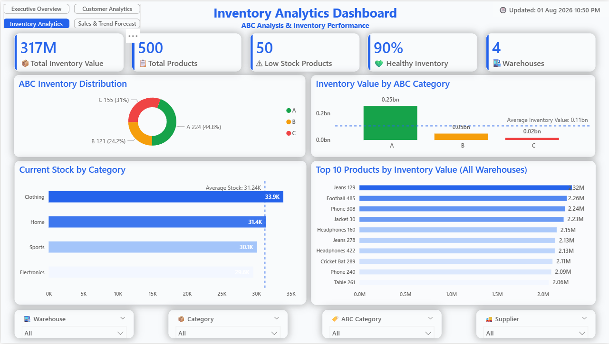

---

## 📈 Sales Forecast & Trends

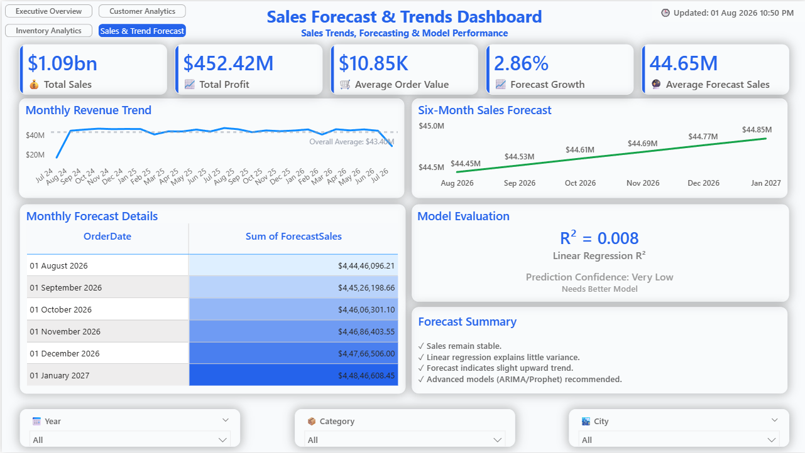

---

# 📷 Analysis Snapshots

### SQL Analysis
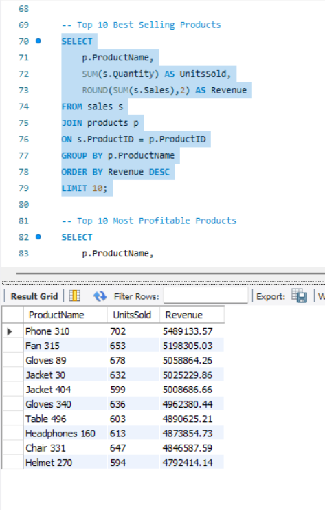

### Python EDA
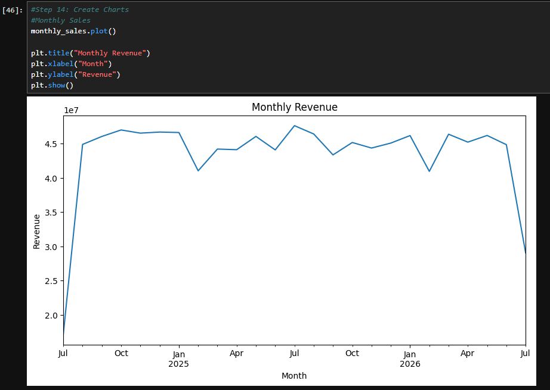

### RFM Analysis
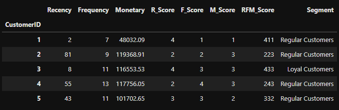

### ABC Inventory Analysis
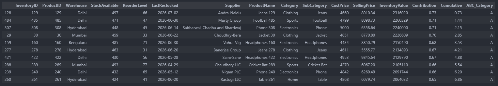

### Forecasting
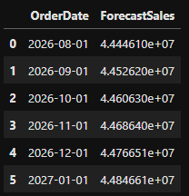

### Business Analysis
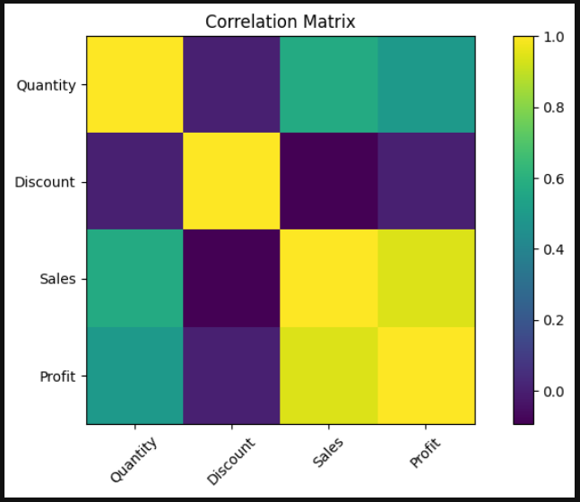

---

# ⚡ Installation

Clone the repository

```bash
git clone https://github.com/your-username/Retail-Sales-Inventory-Analytics.git
```

Move into the project directory

```bash
cd Retail-Sales-Inventory-Analytics
```

Install dependencies

```bash
pip install -r requirements.txt
```

Open the notebooks

```bash
jupyter notebook
```

Open Power BI dashboard

```
powerbi/Retail_Sales_Analytics.pbix
```

---

# 📈 Future Enhancements

- Deploy dashboard online using Power BI Service.
- Integrate live SQL database.
- Build automated ETL pipeline.
- Implement Prophet forecasting.
- Add customer churn prediction.
- Perform demand forecasting using advanced ML models.

---

# 👨‍💻 Author

**Abhishek**

B.Tech Computer Science Engineering

Aspiring Data Analyst | Business Intelligence Analyst | Analytics Engineer

---

# ⭐ If you found this project helpful, consider giving it a star!